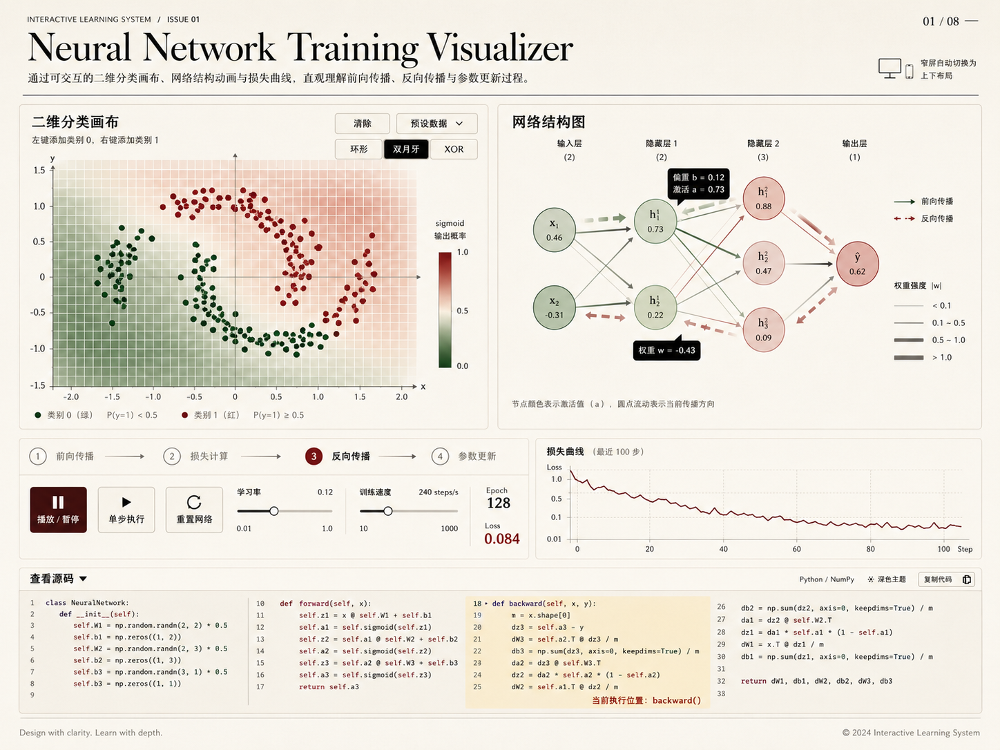

# 神经网络训练可视化页面设计

## 概述

在 VitePress 项目的 `public/` 目录下放置一个独立的 HTML 页面，通过动画和交互展示神经网络训练过程。页面核心是二维分类 playground：用户在二维平面上放置数据点，观察神经网络实时训练并形成分类边界。

## 文件位置

`docs/public/neural-network.html`

- 单文件，零外部依赖（纯 HTML + CSS + JS + SVG）
- 通过 `/neural-network.html` 直接访问
- 可从 `00-neural_network` 章节文档中链接跳转

## 视觉风格

杂志排版风格——以内容至上为核心，传达优雅、专业和对内容的尊重。

### 色彩

- 背景：白色或浅米色（`#faf9f7`）
- 文字：深炭灰（`#1a1a1a`），次要文字中灰（`#666`）
- 强调色：深红色（`#77231d`）作为类别0，深绿色（`#254021`）作为类别1，用于数据点、激活值、关键交互元素
- SVG 网络图元素：黑白灰为主，权重正负用深红/深绿区分
- 决策边界：深红/深绿两色的低透明度渐变，融入整体不抢眼

### 字体

- 标题：衬线字体，使用系统字体栈 `Georgia, "Times New Roman", serif`
- 正文：无衬线，使用系统字体栈 `-apple-system, "Segoe UI", sans-serif`
- 代码/数据标签：等宽字体 `"SF Mono", "Menlo", monospace`，小号
- 字号层级：56px（页面标题）/ 32px（区块标题）/ 24px（子标题）/ 18px（正文）/ 14px（图注、标签）/ 12px（辅助信息）

### 排版细节

- 充足的留白，内容不贴边
- 基线网格对齐
- 段落间距清晰
- 图注用小号灰色字体放在图下方

## 页面布局

### 整体结构



采用杂志编辑式的多区域布局，而非传统的工具型分栏：

```
┌─────────────────────────────────────────────────┐
│                                                 │
│           大标题：神经网络训练实验室               │
│           副标题 + 简短导语（斜体衬线）            │
│                                                 │
├─────────────────────────────────────────────────┤
│                                                 │
│  ┌─── 装饰分隔线 ────────────────────────────┐  │
│                                             │  │
│  二维分类画布（大尺寸，视觉重心）              │  │
│  SVG 散点图 + 决策边界                       │  │
│  图注：点击添加数据点 · 右键切换类别          │  │
│                                             │  │
├─────────────────────┬───────────────────────┤
│                     │                       │
│  网络结构图          │  训练状态面板          │
│  (SVG 节点+连接线)  │  阶段指示器            │
│                     │  损失曲线              │
│  图注：悬停查看参数  │  epoch / loss 数值     │
│                     │                       │
├─────────────────────┴───────────────────────┤
│                                             │
│  控制栏：播放/暂停 | 单步 | 重置 | 学习率    │
│  预设数据选择 | 训练速度                     │
│                                             │
├─────────────────────────────────────────────┤
│  装饰分隔线                                 │
│  可展开源码面板                              │
│  图注：引擎源码，当前执行阶段高亮             │
│                                             │
└─────────────────────────────────────────────┘
```

- 内容区最大宽度约 1200px，居中，两侧留白
- 窄屏自动堆叠为单列

### Hero 区域 — 标题与导语

- 大号衬线标题（56px），下方细装饰线
- 斜体衬线导语，简短描述页面用途（2-3 行）
- 与下方内容之间留大段空白

### 二维分类画布（视觉重心）

- 大尺寸 SVG，占据页面主体宽度的 80% 以上，类似杂志中的跨栏大图
- 白色底 + 浅灰网格线，坐标轴用细线
- 数据点用实心圆，类别0 深红色（`#77231d`）、类别1 深绿色（`#254021`）
- 决策边界：40×40 网格矩形，颜色/透明度对应 sigmoid 输出（0→深红，1→深绿），低透明度融入画布
- 底部图注（14px 灰色）：「点击添加数据点 · 右键切换类别」
- 交互：点击添加点、"清除" 按钮、"预设数据" 下拉选择（环形/双月牙/XOR）

### 网络结构图 + 状态面板（左右分栏）

**左侧 — 网络结构图**：
- 网络结构：2 输入 → 隐藏层1（2节点）→ 隐藏层2（3节点）→ 1 输出
- 节点：圆形，灰色描边，填充颜色深浅随激活值变化（浅灰→深炭灰）
- 连接线：灰色为基调，正权重偏深绿（`#254021`），负权重偏深红（`#77231d`），粗细表示绝对值
- 层名标注用小号无衬线字体
- 训练动画：前向传播信号左→右流动节点依次加深，反向传播右→左流动连接线更新
- 悬停显示偏置值/激活值/权重值（小号等宽字体 tooltip）
- 底部图注：「悬停查看参数」

**右侧 — 状态面板**：
- 训练阶段指示器：4 个标签 `前向传播 → 损失计算 → 反向传播 → 参数更新`，当前阶段用深红色下划线
- 损失曲线：最近 100 步折线图（SVG path），细线 + 填充渐变
- epoch 和 loss 数值用等宽字体显示

### 控制栏

- 水平排列，按钮用细线边框（杂志风格），悬停时填充
- 播放/暂停、单步执行、重置网络
- 学习率滑块（0.01~1.0）、训练速度滑块
- 预设数据选择器

### 源码面板

- 装饰分隔线上方，可展开/折叠，默认折叠
- 展开按钮用文字链接风格「查看引擎源码 ▾」
- 展示引擎源码（`<pre><code>`）
- 语法高亮：黑白色调，关键字用深灰粗体，字符串用斜体，注释用浅灰
- 当前执行阶段对应的函数用深红色左边框高亮
- 与训练阶段指示器和动画联动

## 代码架构

单文件内通过注释和结构清晰划分为两层：

```
<script>
// ===== 神经网络引擎 =====
// 纯计算逻辑，不依赖任何 DOM/SVG
// 对应文档中的教学概念，每个函数职责单一

// ===== 可视化层 =====
// 负责所有 SVG 渲染和用户交互
// 只通过引擎 API 获取数据，不包含计算逻辑
</script>
```

### 神经网络引擎 API

- `NeuralNetwork.init(sizes)` — 按层初始化权重和偏置
- `NeuralNetwork.forward(input)` — 前向传播，返回各层激活值
- `NeuralNetwork.computeLoss(predictions, targets)` — 均方误差
- `NeuralNetwork.backward(input, target)` — 反向传播，返回梯度
- `NeuralNetwork.updateParameters(gradients, learningRate)` — 梯度下降更新
- `NeuralNetwork.trainStep(samples, learningRate)` — 一步完整训练
- `NeuralNetwork.getState()` — 返回当前所有权重、偏置、激活值快照

### 引擎代码风格

- 与文档 `04-summary-and-practice.md` 示例保持一致
- 简单变量名、清晰函数划分、不做过度封装
- 代码本身即教学内容，约 60-80 行核心逻辑
- 包含 sigmoid 激活函数

## 技术选型

- **渲染**：纯 SVG（散点图、决策边界、网络结构图、损失曲线）
- **动画**：requestAnimationFrame + SVG 属性更新
- **样式**：内联 CSS，杂志风格排版（白底、衬线标题、充足留白）
- **语法高亮**：CSS 手写着色（黑白灰色调）
- **零依赖**：不引入任何外部 CSS/JS 库

## 与文档内容的对应关系

| 页面元素 | 对应文档概念 | 文档章节 |
|---------|------------|---------|
| 网络结构图 | 神经元、层、激活函数、前向传播 | 01-basic-concepts |
| 决策边界变化 | 参数（权重、偏置）对预测的影响 | 01-basic-concepts |
| 损失值/曲线 | 损失函数衡量预测质量 | 02-loss-function |
| 反向传播动画 | 反向传播分配参数责任 | 03-training-neural-network |
| 参数更新动画 | 梯度下降、学习率 | 03-training-neural-network |
| 播放/暂停训练循环 | 训练闭环 | 04-summary-and-practice |
| 源码面板 | 代码练习对应关系 | 04-summary-and-practice |
| 训练阶段指示器 | 推理 vs 训练两个视角 | 04-summary-and-practice |
